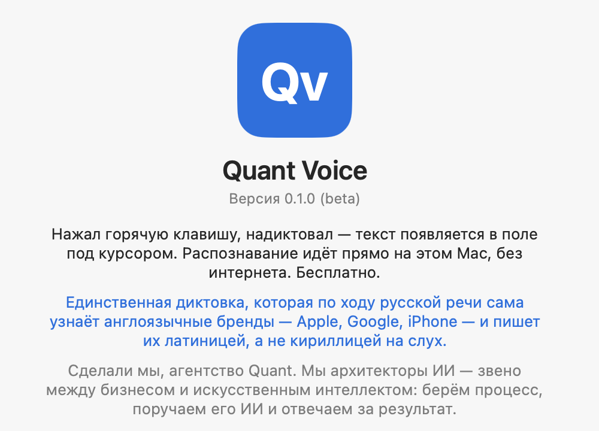
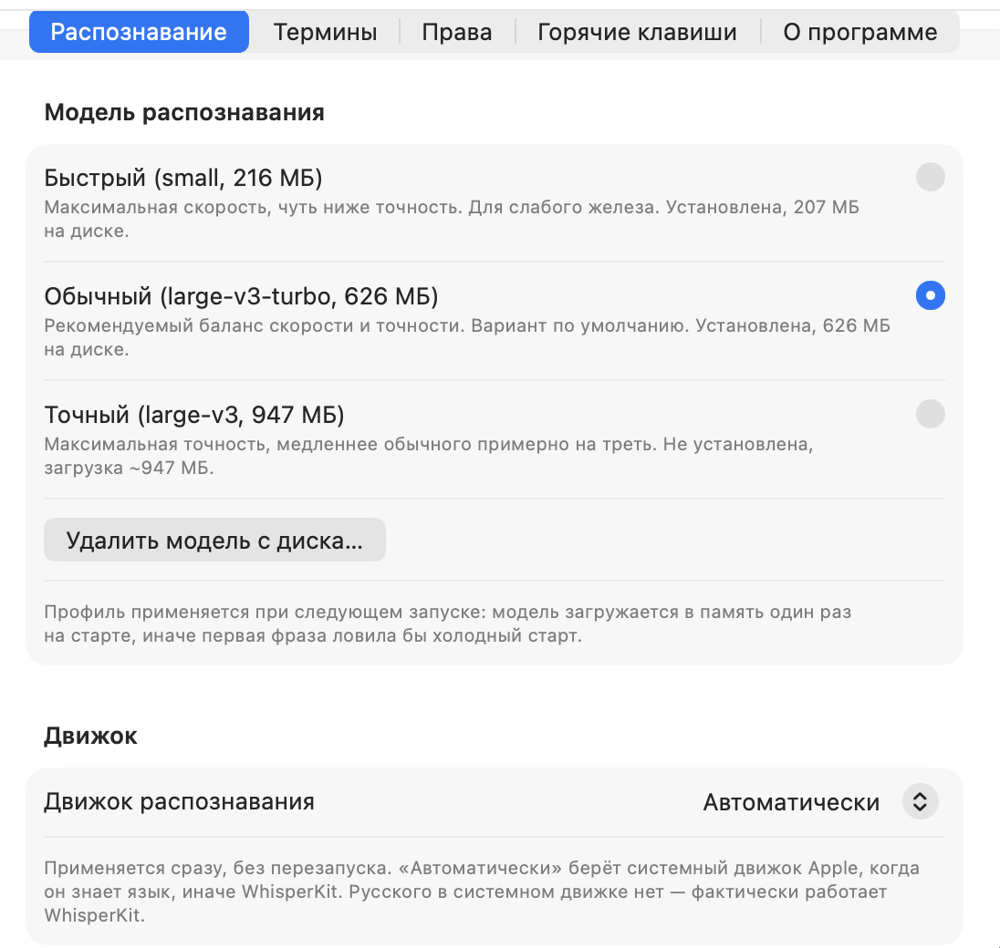
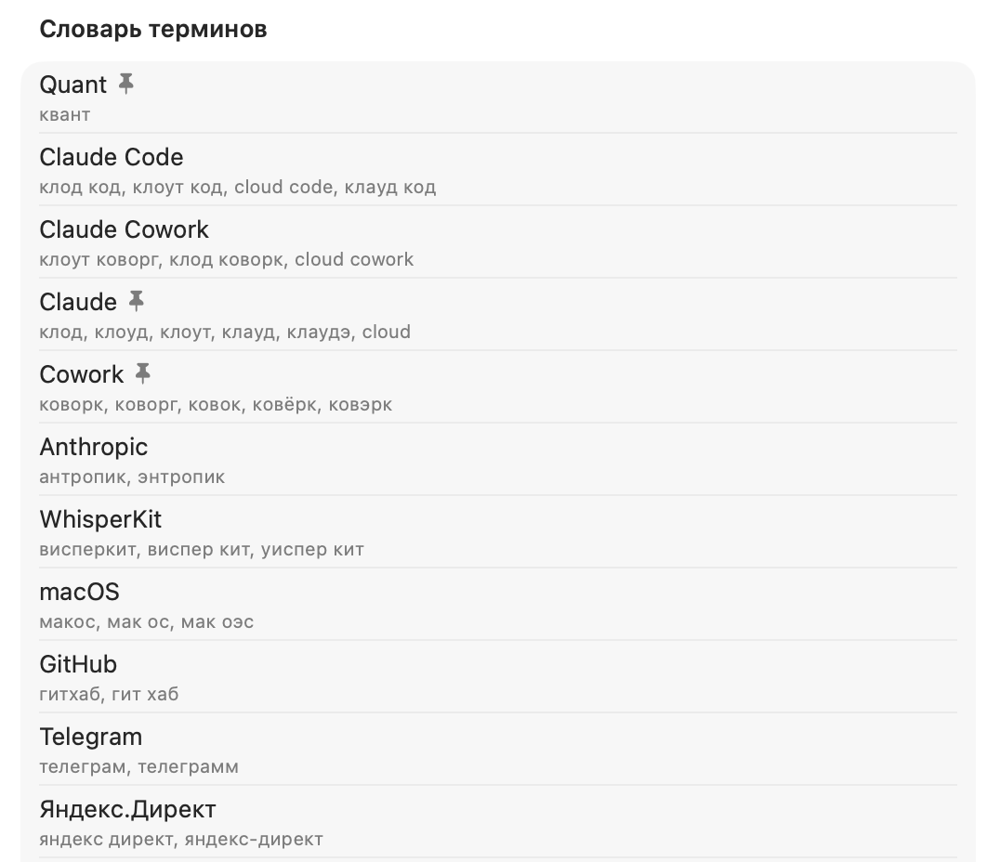

# Quant Voice

**Голосовой ввод для macOS. Распознавание на устройстве, полностью офлайн, бесплатно.**

Нажал горячую клавишу, надиктовал — текст появился в поле под курсором. Ни один звук не уходит в сеть.

---

Quant Voice превращает речь в текст прямо на вашем Mac. Нажимаете горячую клавишу, говорите — распознанный текст впечатывается в то поле, где стоит курсор: в заметку, мессенджер, письмо, поле ввода. Распознавание работает на устройстве, звук не покидает компьютер и никуда не отправляется. Русский и английский, в том числе английские слова внутри русской фразы. Исходный код открыт целиком.

**Главное отличие — бренды.** Это единственная программа голосового ввода, которая уверенно распознаёт англоязычные названия и сама понимает, где их писать латиницей. Диктуете по-русски и упоминаете Apple, Google, iPhone, WhatsApp, Photoshop — Quant Voice сам определяет, что это бренд, и вставляет его правильным написанием, не превращая в кириллическую кашу. Обычные диктовки на этом спотыкаются; здесь это работает из коробки и настраивается под ваш словарь.

В основе — модель Whisper, запущенная локально через WhisperKit. Никаких облачных диктовок, подписок и аккаунтов: скачали, поставили, пользуетесь.

## Как выглядит

  

  
  

## Что умеет

**Диктует в любое приложение.** Нажали хоткей, сказали фразу — текст вставляется туда, где курсор. Короткое нажатие включает запись до второго нажатия, удержание — пишет, пока клавиша зажата. Esc отменяет.

**Работает офлайн.** Модель распознавания резидентна в памяти, интернет для диктовки не нужен вообще. Единственный раз, когда нужна сеть, — скачать модель при первой настройке.

**Сам ставит бренды латиницей.** Единственная диктовка, которая по ходу русской речи узнаёт англоязычные названия — Apple, Google, iPhone, Photoshop — и сама пишет их правильно, а не кириллицей на слух. Словарь терминов с морфологией и фонетикой понимает бренд в любой форме и подставляет каноническое написание. Свои термины добавляются в пару кликов.

**Причёсывает текст.** Точка в конце фразы, заглавная после точки, лишние пробелы, звуковые «эээ» — базовая чистка офлайн за доли миллисекунды. Отключается, если надиктовываете кусок внутрь готового текста.

**Даёт выбрать скорость против точности.** Несколько профилей модели — от быстрого (медиана ~740 мс) до точного. Выбор применяется при следующем запуске: модель грузится в память один раз на старте, чтобы первая фраза не ловила холодный старт.

**Живёт в строке меню.** Иконка «Qv» рядом с часами, в Dock приложения нет. Состояние — слушаю, распознаю, вставляю — видно прямо по иконке.

## Почему этому можно доверять

Приложение слушает микрофон и вставляет текст в чужие окна. Возможности чувствительные, поэтому — по пунктам, что оно делает и чего не делает.

- **Распознавание на устройстве.** Речь превращается в текст локально, моделью в памяти этого Mac. Звук не отправляется ни на какие серверы — ни Apple, ни чьи-либо ещё.
- **Открытый код.** Весь исходник в этом репозитории. Соберите сами и убедитесь, что приложение делает ровно то, что написано.
- **Ваш голос и текст не пишутся на диск.** Аудио живёт в памяти на время фразы и стирается после распознавания. Распознанный текст приложение вставляет и забывает — истории надиктованного нет.
- **Никакой телеметрии.** Приложение не собирает статистику и не «звонит домой». Локально хранятся только настройки и ваш словарь терминов.
- **Сеть — только по вашему клику.** Единственное сетевое действие — скачивание модели распознавания, которое вы запускаете сами и видите её размер заранее.

Приложение просит два разрешения: **микрофон** (иначе не слышит речь) и **Универсальный доступ** (иначе не видит хоткей и не может вставить текст в поле под курсором). Оба — требования самой macOS, и приложение честно объясняет их при первом запуске.

## Установка

1. Скачайте свежий `QuantVoice.dmg` из раздела [**Releases**](../../releases).
2. Откройте DMG и перетащите `Quant Voice` в «Программы».
3. Запустите. При первом старте macOS может предупредить, что приложение от неустановленного разработчика — это нормально для бесплатных программ без платной нотаризации Apple. Откройте «Системные настройки → Конфиденциальность и безопасность» и нажмите «Всё равно открыть». Либо: правый клик по иконке приложения → «Открыть».
4. Приложение появится в строке меню значком «Qv» (в Dock его нет — так задумано).
5. Скачайте модель распознавания: значок «Qv» → «Модель распознавания» → выберите профиль. Без модели диктовка не работает.
6. Выдайте два разрешения — микрофон и Универсальный доступ — приложение подскажет, где.

Требуется macOS 14 (Sonoma) или новее.

Если предпочитаете собрать приложение сами — см. [BUILD.md](BUILD.md).

## Как это устроено

Нажатие хоткея запускает запись с микрофона. Аудио идёт в движок распознавания: на этой машине это Whisper через WhisperKit (в системном движке Apple `SpeechTranscriber` русского нет, поэтому WhisperKit — основной, а не запасной). Модель загружена в память заранее, на старте приложения. Распознанный текст проходит офлайн-причёсывание и подстановку ваших терминов, после чего вставляется в поле под курсором штатными средствами Accessibility. Всё — на устройстве, без единого сетевого запроса.

Приложение сознательно **не** использует песочницу App Store: перехват хоткея и вставка в чужие окна с ней несовместимы. Поэтому распространяется прямым скачиванием, а не через Mac App Store.

Подробнее о приватности — в [SECURITY.md](SECURITY.md).

## Лицензия

Код распространяется по лицензии [MIT](LICENSE) — используйте, изучайте, форкайте свободно.

Название «Quant», логотип и фирменный стиль лицензией **не покрываются** и остаются за агентством Quant. Форкам просьба использовать собственное имя и оформление.

## Об авторе

Quant Voice сделан агентством автоматизации **Quant** и раздаётся бесплатно. Мы берём процесс, поручаем его ИИ и отвечаем за результат. Нужна автоматизация под вашу задачу — [quant-agency.ru](https://quant-agency.ru).
